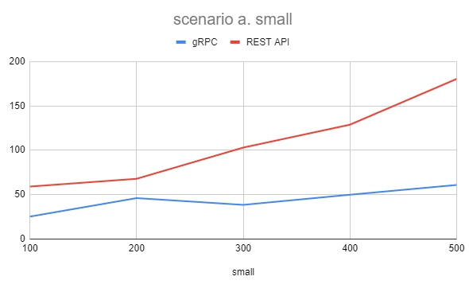
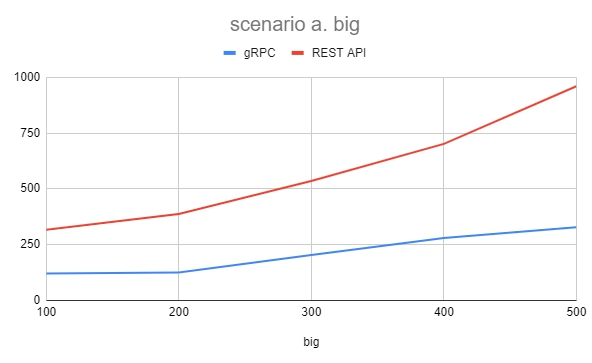
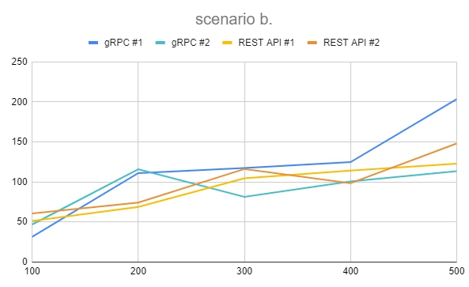
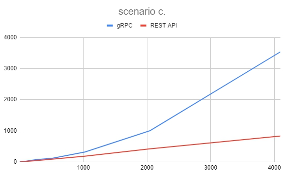

# Assignment #2: gRPC and REST API Benchmarking

## Members
1. Naravich Chutisilp		    6030319921
2. Navabhorn Pandee 		    6030324021
3. Pornapat Sudjaipraparat 	6030394921
4. Ravipas Aphikulvanich	  6031050121

## 1. Graphs showing the benchmarking results with the explanation of your experimental settings.
### a. Single client with a small call to insert a book item, a bigger call to insert a list of multiple book items. 

ทั้ง small call และ bigger call จะเห็นได้ว่า gRPC จะเร็วกว่าอย่างเห็นได้ชัด
### b. Multiple clients with different kind of calls.

ให้ client แต่ละคนเรียกฟังก์ชั่นแบบสุ่ม โดยสองคนเรียกผ่าน REST API ส่วนอีกสองคนเรียกผ่าน gRPC
### c. Vary the number of concurrent calls from 1 to 4096 calls. 

ให้ client ส่ง request ไปเรื่อย ๆ เป็นจำนวน n = [1, 2, 4, 8, 16, 32, 64, 128, 256, 512, 1024, 2048, 4096] ครั้ง โดยที่ไม่ต้องรอตัวก่อนหน้าทำเสร็จ พร้อมวัด response time โดยจากกราฟด้านบนจะเห็นได้ว่า REST API จะเร็วกว่า gRPC

## 2. Discussion of the results why one method is better the other in which scenarios. 

## 3. Comparison of the gRPC and REST API from the aspects of language neutral, ease of use, and performance. 

## 4. Does your results comply with the results in https://medium.com/@bimeshde/grpc-vs-rest-performance-simplifiedfd35d01bbd4? How?
